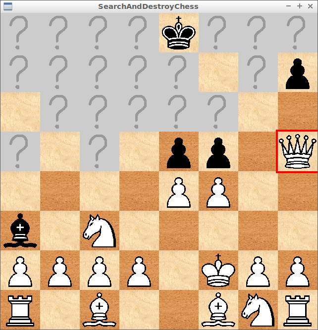
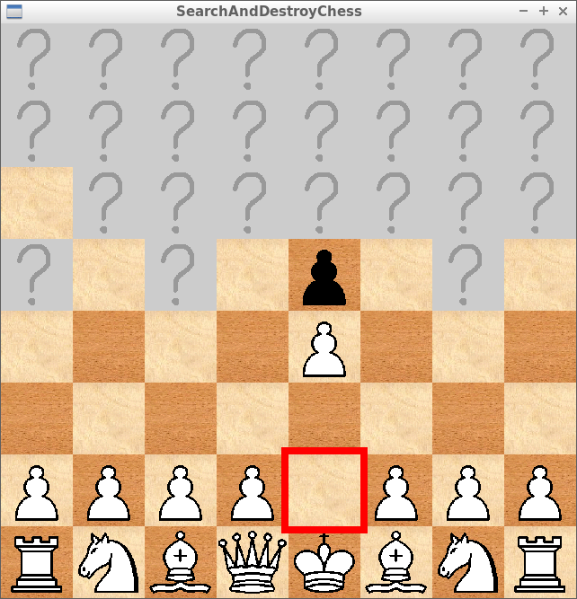
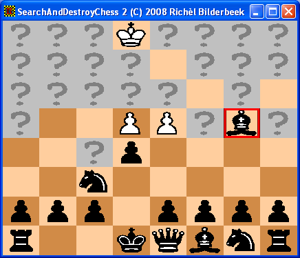
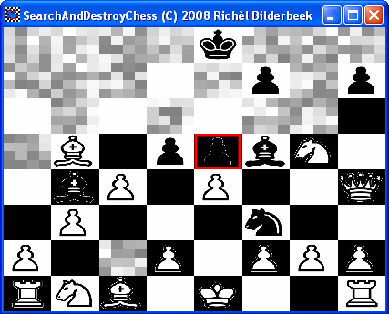

# SearchAndDestroyChess

Branch||
---|---|---
master||
develop||

Chess game with a fog of war, programmed in C++ using SFML.

The following special rules apply to SearchAndDestroyChess:

 * A player cannot be in chess, nor in checkmate. Instead, if the king is captured, the capturer wins. This is because it is possible for a king to be in check without knowing it
 * Normal rules to en passant capture apply. But when a pawn can be captured en passant, this pawn is visible. This makes a pawn look sideways for only one turn. This is because the attacker must be able to see that he/she can make an en passant capture
 * Normal rules to castling apply, except that castling can take place when in chess and through attacked squares. This is because it is possible for a king to be or getting in check without knowing it
 * A pawn always gets promoted to a queen

The first version of SearchAndDestroyChess was put online at 2008-07-06. I month later I 
found out I wasn't the first to have invented this variant: 
it is also known as [Kriegspiel](https://en.wikipedia.org/wiki/Kriegspiel_%28chess%29)
or [Dark Chess.](https://en.wikipedia.org/wiki/Dark_chess)

## Gameplay

The first screen will be the `Press enter to start the next turn` screen.
Here, (the person playing) white has to assure black is looking away.
If black is looking away, white presses enter.
White can do a move like regular chess now.

When white has done his/her move, the `Press enter to start the next turn` screen pops up again.
Now, black has to assure white is looking away.
If white is looking away, black presses enter.
Black can do a move like regular chess now.

Repeat this until a player can capture the king of the opponent. 
Then, it is common to show the opponent he/she will be captured, so he/she
can see the position of the winning player his/her pieces.  

## Controls

 * `Up arrow` or `W`: move cursor up
 * `Right arrow` or `D`: move cursor right
 * `Down arrow` or `S`: move cursor down
 * `Left arrow` or `A`: move cursor left
 * `Space` or `Q` or `E`: select
 * `Enter`/`Return`: start next turn, only works at the `Press enter to start the next turn` screen 

Also selection works with the mouse.

## Strategy

 * Prefer to keep your king protected in all 16 directions (4x diagonal, 4x horizontal, 8x knigh jumps)
 * Castling is extra strong
 * Bluffing is an important part of the game
 * In trouble? Make that unexpected move!
 * Try to cover all your pieces
 * Try to see as much of the board as possible
 * Being in center positions is nice, in this game coverage and lines of sight are more important

## Older screenshots

## External links

 * [Richel Bilderbeek's games](https://github.com/richelbilderbeek/Games)
